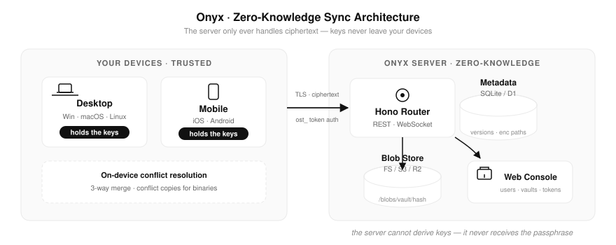
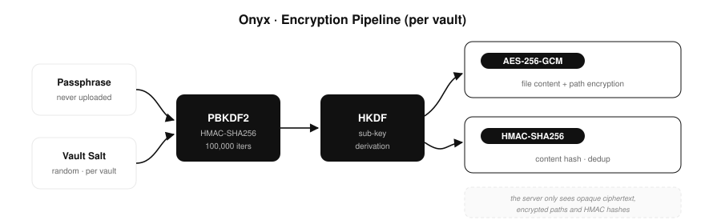

<div align="center">


# Onyx

**自部署 · 零知识 · 端到端加密的 [Obsidian](https://obsidian.md) 同步引擎**

简体中文 · [**English**](README.md)

[](LICENSE)
[](https://obsidian.md)
[](package.json)
[](https://github.com/dxer/onyx-sync/pulls)

**Onyx Server** 可部署在 [Cloudflare Workers](https://workers.cloudflare.com/) 的免费套餐上，也可以用 Docker 跑在任意廉价 VPS 上。**Onyx Sync** 是与之配套的 Obsidian 插件。

</div>

---

## 为什么选择 Onyx？

服务端**永远接触不到你的明文**。它只存储 AES-256-GCM 密文块、加密后的路径与 HMAC 内容哈希。即使服务端整个丢失，你的数据依然安全——密钥只在你手中。

Onyx 提供的是一套完整的**产品**：一个带管理控制台的轻量多用户服务端，加上一个打磨完善的跨平台客户端插件——而不只是一个同步脚本。

---

## 与主流 Obsidian 同步方案对比

| | **Onyx** | Obsidian Sync（官方） | [Remotely Save](https://github.com/remotely-save/remotely-save) | [Self-hosted LiveSync](https://github.com/vrtmrz/obsidian-livesync) |
| :--- | :--- | :--- | :--- | :--- |
| **费用** | ✅ 免费（Workers 套餐）或 VPS 约 ¥7/月 | 💰 $4–8 / 月 | ✅ 免费（各云存储免费额度） | ✅ 免费（自建 CouchDB） |
| **数据所有权** | 🏠 100% 自己的服务器 | ☁️ Obsidian 官方云 | 🏠 自己的云存储桶 | 🏠 自己的 CouchDB |
| **自带服务端软件** | ✅ 专为同步设计的轻量服务端（Hono，单容器部署） | ❌ 闭源服务 | ⚠️ 无需服务端——客户端直连云存储 | ⚠️ 通用 CouchDB（较重，运维靠自己） |
| **Cloudflare 免费部署** | ✅ Workers + D1 + R2 | ❌ | ❌ | ❌ |
| **零知识端到端加密** | ✅ 强制开启（AES-256-GCM + PBKDF2/HKDF） | ✅ 可选 | ⚠️ 可选，仅 S3/WebDAV | ⚠️ 可选 |
| **文件路径加密** | ✅ 服务端看不到文件名 | ❌ 元数据含路径 | ❌ 路径即对象键名 | ❌ |
| **多用户 / 团队** | ✅ 管理控制台、按用户隔离、关闭公开注册 | ⚠️ 按账号席位收费 | ❌ 单用户 | ❌ 按数据库划分，无用户管理界面 |
| **设备凭据全生命周期** | ✅ 生成 / 重命名 / 轮转 / 吊销，按设备独立凭据 | ⚠️ 仅解绑设备 | ❌ 共享同一云密钥 | ❌ 数据库账号密码 |
| **本地凭据密封保护** | ✅ DPAPI / Keychain / 移动端沙盒密钥——盗走 `data.json` 也无法使用 | ✅ | ❌ 插件数据明文存储 | ⚠️ 明文存储数据库密码 |
| **物理存储隔离** | ✅ `/blobs/<vault>/…` 按仓库分区 | ❌ | ⚠️ 手动配置桶 / 前缀 | ⚠️ 按数据库 |
| **冲突解决** | ✅ Markdown 三路合并 + 二进制冲突副本；扫描永不误判删除 | ✅ 版本历史 | ⚠️ 后写覆盖 | ✅ 基于 CouchDB 复制机制 |
| **实时推送** | ✅ WebSocket 通知 + 智能后台同步 | ✅ | ❌ 手动 / 定时 | ✅ 接近实时 |
| **管理控制台** | ✅ Vercel 风格仪表盘：用户、仓库、设备、存储、365 天活跃热力图 | ⚠️ 基础网页设置 | ❌ | ❌ |
| **部署复杂度** | 🟡 启动一个服务端 + 插件填 3 个字段 | 🟢 最简单 | 🟡 创建云存储桶和密钥 | 🔴 需正确配置 CouchDB |
| **成熟度** | 🌱 年轻项目 | 🏆 官方出品，久经考验 | 🏆 成熟，用户量大 | 🏆 成熟，用户量大 |

**适合选择 Onyx**：你想要官方 Sync 级别的使用体验（多设备配对、令牌管理、活跃度洞察），但基础设施完全属于自己、成本趋近于零、并要求严格的零知识保证——包括文件名也不泄露给服务端。

**可以考虑其他方案**：完全不想维护任何服务端（Remotely Save）；需要实时协作式编辑流（LiveSync）；或只求省心付费托管（官方 Sync）。

---

## 架构



### 零知识加密流水线



### 冲突解决

Markdown 笔记采用**三路合并**（通过 `diff-match-patch` 对比 基准版本 / 本地 / 远程）；二进制文件采用后写覆盖并生成冲突副本。删除操作只由明确的文件系统事件传播——全新安装的空库**绝不会**误删云端数据。

---

## 核心特性

- 🔐 **零知识端到端加密** —— AES-256-GCM 内容加密、路径加密、HMAC 内容寻址；服务端只是一个"哑巴"密文存储
- 👥 **多用户多仓库** —— 按仓库物理隔离存储（`/data/blobs/<vault_id>/…`），管理员统一开通账号，默认关闭公开注册
- 🪙 **设备令牌** —— 在 Web 控制台生成 / 重命名 / 轮转 / 吊销每个设备的专属凭据；令牌与单一仓库绑定
- 🛡️ **静态凭据密封** —— 插件凭据用 Windows DPAPI / macOS Keychain（桌面端）与应用沙盒密钥（移动端）密封；拷走 `data.json` 也无法登录
- 📊 **活跃热力图** —— 每个仓库的 GitHub 风格 365 天同步活跃度
- 🌐 **双语控制台** —— Vercel 风格仪表盘，一键切换中文 / English
- ⚡ **实时推送** —— WebSocket 通知 + 后台定时同步 + 静默变更检测
- 📱 **全平台** —— Windows、macOS、Linux、iOS、Android 同一套代码

---

## 快速开始

### 1. 启动服务端

**方式 A —— VPS / 本地机器（Node.js ≥ 18）：**

```bash
git clone https://github.com/dxer/onyx-sync.git
cd onyx-sync
cp .env.example .env          # 修改 ADMIN_USERNAME / ADMIN_PASSWORD
pnpm install
pnpm build
pnpm start
```

控制台即刻运行在 `http://localhost:8080`。

**方式 B —— Docker（CI 预构建的 Alpine 镜像）：**

```bash
# 使用 ghcr.io/dxer/onyx-sync:latest（linux/amd64）
docker compose up -d
```

**方式 C —— Cloudflare Workers（100% 免费套餐）：**

```bash
# 创建 D1 数据库 + R2 存储桶，填写 wrangler.toml
wrangler d1 create onyx-db
wrangler deploy
```

### 2. 创建仓库与设备令牌

1. 打开控制台，用管理员账号登录
2. **新建知识库** → 命名
3. **授权新设备** → 复制生成的 `ost_…` 令牌

### 3. 安装 Obsidian 插件

从官方客户端仓库 [onyx-sync-obsidian](https://github.com/dxer/onyx-sync-obsidian) 安装：
- **社区插件市场安装**：在 Obsidian 设置中的“社区插件”搜索 **Onyx Sync** 安装（或通过 BRAT 插件测试版安装）；
- **手动安装**：从 [插件 Release 页面](https://github.com/dxer/onyx-sync-obsidian/releases) 下载 `main.js` 和 `manifest.json`，放进 `<知识库>/.obsidian/plugins/onyx-sync/`。

在 Obsidian 设置中启用 **Onyx Sync** 并填写：

| 字段 | 值 |
| :--- | :--- |
| 服务端地址 | `http://你的服务器:8080` |
| 设备令牌 | 控制台生成的 `ost_…` |
| 加密主密码 | 你的 E2EE 主密码——**所有设备必须一致** |

完成。编辑一篇笔记，看着它出现在你的其他设备上。

---

## 配置

服务端配置位于 `.env`（见 [.env.example](.env.example)）：

| 变量 | 默认值 | 说明 |
| :--- | :--- | :--- |
| `PORT` | `8080` | HTTP 端口 |
| `ADMIN_USERNAME` | `admin` | 自动开通的超级管理员 |
| `ADMIN_PASSWORD` | — | 每次启动自动同步进数据库 |
| `DB_PATH` | `./data/sync.db` | SQLite 元数据文件 |
| `STORAGE_TYPE` | `local` | `local` 或 `s3`（S3 / MinIO / R2） |
| `STORAGE_LOCAL_DIR` | `./data/blobs` | 密文块根目录（每个仓库一个子目录） |
| `S3_*` | — | `STORAGE_TYPE=s3` 时的端点 / 桶 / 密钥 |
| `WS_TICKET_SECRET` | 临时随机 | 签发短期 WebSocket ticket 的密钥；设置后 ticket 可跨进程重启有效 |

---

## API 概览（v1）

```
GET    /api/v1/session                    # 令牌握手：仓库、盐值、设备信息
GET    /api/v1/sync/status                # 最新版本时钟
GET    /api/v1/sync/changes?since=N       # 增量变更日志
POST   /api/v1/sync/commit                # 推送加密变更（带 requestId 即幂等可重放）
POST   /api/v1/sync/blobs/check           # 内容寻址去重检查
PUT    /api/v1/sync/blobs/:hash           # 上传密文块
GET    /api/v1/sync/blobs/:hash           # 下载密文块
POST   /api/v1/ws/ticket                  # 用设备令牌换取 60 秒一次性 WS ticket
GET    /api/v1/user/vaults/:id/activity   # 365 天热力图数据
POST   /api/v1/user/vaults/:id/gc         # 回收无引用密文块（可选 { "graceDays": 7 }）
DELETE /api/v1/user/vaults/:id            # 异步删除任务（先元数据后密文块）
GET    /api/v1/user/deletion-jobs/:jobId  # 删除任务状态
POST   /api/v1/user/deletion-jobs/:jobId/retry
PATCH  /api/v1/user/tokens/:tokenId       # 设备重命名
POST   /api/v1/user/tokens/:tokenId/rotate  # 轮转凭据（旧密钥立即失效）
DELETE /api/v1/user/tokens/:tokenId       # 吊销凭据
```

所有同步接口自动限定在令牌绑定的仓库范围内——跨仓库访问在结构上就不可能发生。

**实时推送与部署形态**：Node/Docker 服务端支持 WebSocket 推送——客户端先通过
`POST /api/v1/ws/ticket` 换取 60 秒一次性 ticket，再连接 `/api/v1/ws?ticket=…`；
吊销令牌会主动断开其活动连接。Cloudflare Worker 部署只提供 REST + 轮询
（不做跨实例 WebSocket 广播）；ticket 接口在 Worker 上返回 `501`，插件会自动回退到定时轮询。

---

## 安全模型

- **服务端可见**：密文、不可读的路径密文、HMAC 哈希、仓库版本时钟、设备名称
- **服务端永不可见**：主密码、加密密钥、明文内容、明文文件名
- **凭据静态存储**：令牌密钥在服务端只保存 SHA-256 哈希（`auth_tokens` 表）；`ost_…` 明文仅在创建 / 轮转时展示一次；吊销与过期（master 30 天 / device 180 天）在每次请求时强制校验
- **内容完整性**：内容哈希是对明文的客户端 HMAC（零知识设计），服务端无法重算——客户端在上传前验证 `解密(密文)` 哈希一致、每次下载后再验一次
- **客户端静态存储**：令牌与主密码经 DPAPI / Keychain（桌面端）或应用沙盒密钥（移动端）密封
- **注册机制**：默认关闭公开注册——首个账户自动成为管理员；后续账户全部由管理员开通

---

## 项目结构

```
onyx/
├── src/           # Onyx 服务端 —— Hono 应用、存储驱动、控制台
├── plugin/        # Onyx Sync —— Obsidian 插件（全平台）
├── shared/        # @onyx/shared —— 加密、三路合并、协议类型
├── docs/          # Logo 与图表
├── Dockerfile
├── docker-compose.yml
└── wrangler.toml  # Cloudflare Workers 部署配置
```

## 开发

```bash
pnpm install
pnpm dev            # 服务端热重载
pnpm build          # 全量构建：shared + 服务端 + 插件
pnpm build:plugin   # 仅构建插件
pnpm test           # 单元测试
```

## 许可证

[MIT](LICENSE)

---

<div align="center">

**Onyx** —— 你的笔记，你的服务器，你的密钥。


</div>
